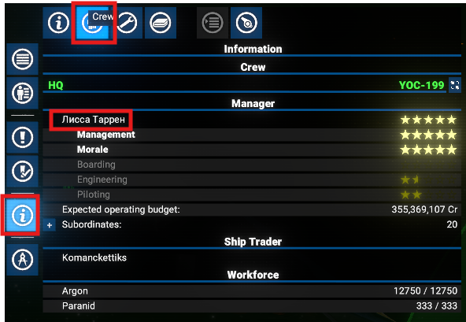
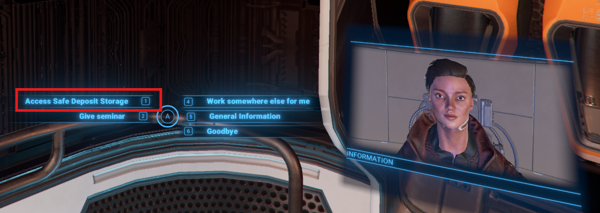
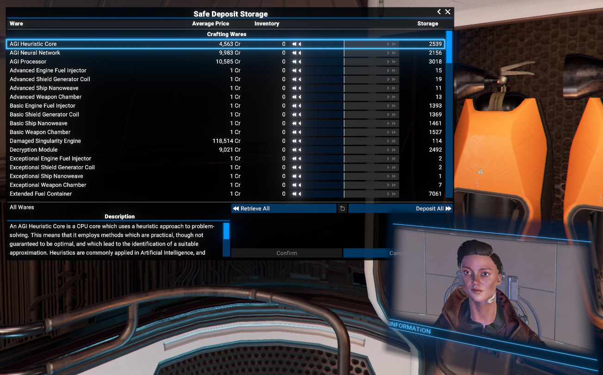
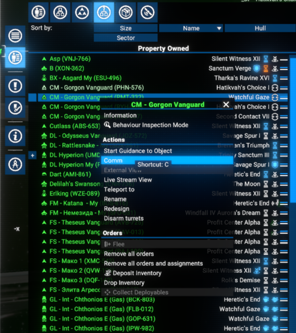
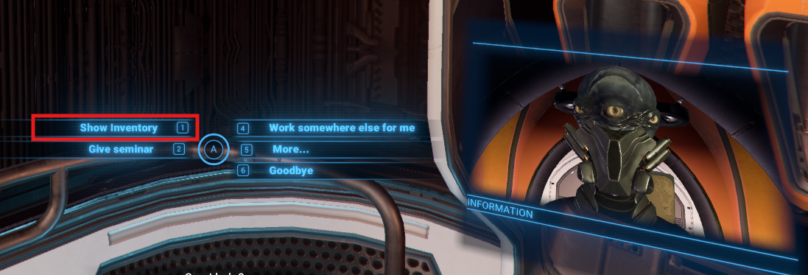
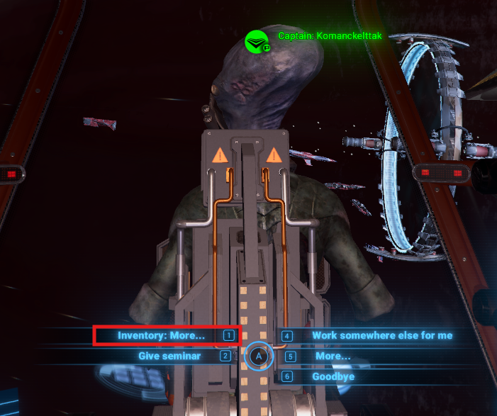
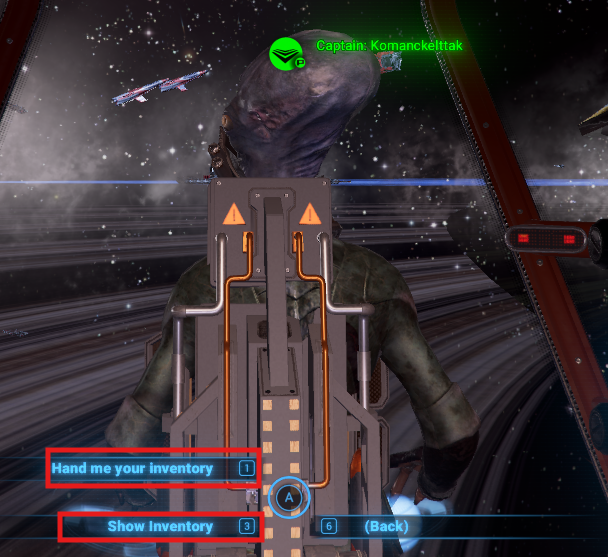
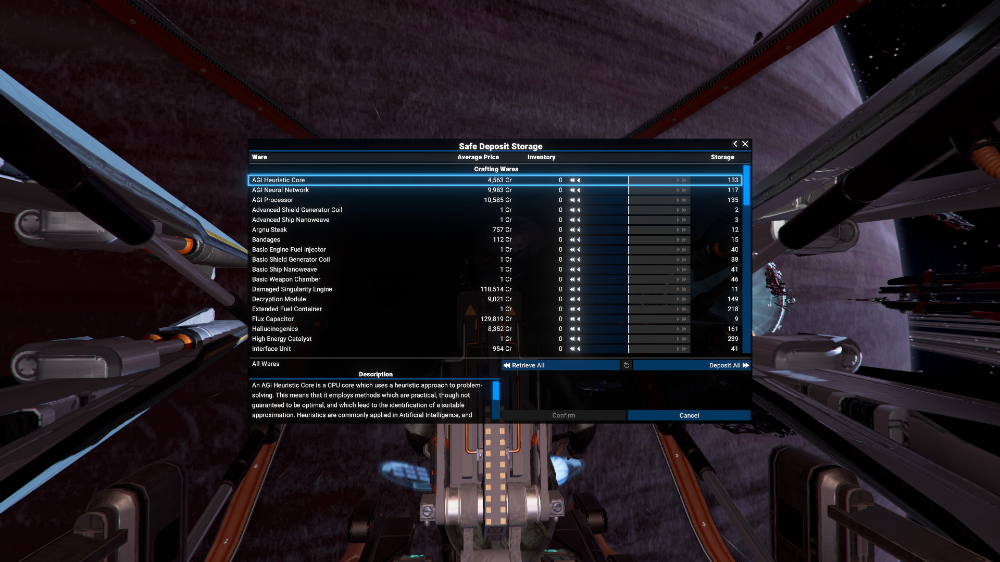

# Remote Access to Safe Deposit Storage and Pilot's Inventories

In game, the player can access the Safe Deposit Storage only when he is in appropriate room of the Headquarters. But in parallel, the Player can research the individual Teleportation technology, which allows to teleport to HQ from any place in the game universe, at the end of the research tree.

This mod implements the remote access functionality, allowing players to manage their Safe Deposit Storage and, as side effect - the Pilot's Inventories, from anywhere in the game world, as long as they have completed the necessary research.
It is mean - the distance, from which the player can access the Safe Deposit Storage and Pilot's Inventories, is limited only by the range of the Teleportation technology.

## Compatibility

This mod is compatible with the game version 7.10 and higher.

## Features

- Access to Safe Deposit Storage and Pilot's Inventories from anywhere in the game world, depending on the Teleportation technology range.
- Ability to transfer items between Safe Deposit Storage and Pilot's Inventories and Player's inventory.

## Download

You can download the latest version via Steam - [Chem O`Dun's Workshop on Steam](https://steamcommunity.com/sharedfiles/filedetails/?id=)
Or you can do it via the [Chem O`Dun's Mods list on Nexus Mods](https://next.nexusmods.com/profile/ChemODun/mods?gameId=2659)

## Usage

### Accessing the HQ's Safe Deposit Storage

To get an access to the Safe Deposit Storage on Player's HQ, you should make several simple steps:

- Establish a communication with the Player's HQ Station Manager on `Crew` tab of the `Information` menu of the Player's HQ.

- There will be a new button `Access Safe Deposit Storage` in a top left corner of the interaction menu.

- Simple press it, and the standard Safe Deposit Storage Screen will be opened, allowing you to manage your Safe Deposit Storage as usual.

### Accessing the Pilot's Inventories

To get an access to the Pilot's Inventories, you should do next:

- Establish a communication with the Pilot directly via context menu of the appropriate ship or via the same `Crew` tab of the `Information` menu of the ship.

- For the Pilot's Inventory, there will be a new button `Show Inventory` in a top left corner of the interaction menu.

Important notice - you have not to be a pilot of any other ship, otherwise the Pilot's Inventory will not be available for you, as it's slot will be occupied by other command.

In addition there will be a change in interaction with a pilot/commander of the ship when you are on the same ship.

- Instead of the "standard" `Hand me inventory` command, there will be a new command `Inventory: More...` in the context menu of the pilot/commander.

- Which will contain both `Hand me inventory` and `Show Inventory` commands inside.

In both cases, the Pilot's Inventory will be opened in the same way as the Safe Deposit Storage, allowing you to manage it more granularly, then simply transferring items to the Player's inventory.
Important remark - the Title of the opened window will be the same as for the Safe Deposit Storage, but the content will be Pilot's Inventory.

There is a short video with gameplay demonstration - [X4 Foundations - Remote Access to Safe Deposit Storage and Pilot's Inventories](https://www.youtube.com/watch?v=ajfj0C5JpwI)

## License

This mod is released under the [Apache License 2.0](LICENSE).

## Links

There is a thread on EgoSoft forum - [[Mod/MD] Remote Access to Safe Deposit Storage and Pilot's Inventories](https://forum.egosoft.com/viewtopic.php?t=471543)
